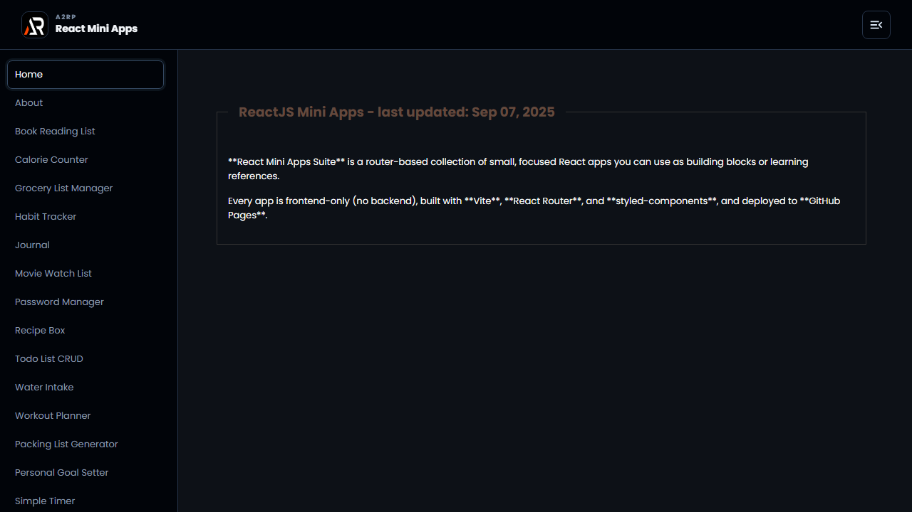

# React Mini Apps Suite

A frontend-only collection of focused React mini apps for everyday tasks, learning and experimentation. The suite uses client-side routing, local browser storage where useful, and a shared responsive shell.



## Included apps

- Planning tools: habits, goals, workouts, packing, groceries and tasks
- Utilities: QR generation, unit conversion, timers, text editing and color palettes
- Creative and game experiences: drawing, recipes, quotes, quizzes, word scramble and tic-tac-toe

## Tech stack

React, React Router, Vite, styled-components, Material UI and react-icons.

## Run locally

```bash
npm install
npm run dev
```

Build and deploy:

```bash
npm run lint
npm run build
npm run deploy
```

Live: https://a2rp.github.io/react-mini-apps-suite/

## Links

- Portfolio: https://www.ashishranjan.net/
- GitHub: https://github.com/a2rp
- CodePen: https://codepen.io/ash1198
- LinkedIn: https://www.linkedin.com/in/aashishranjan
- Facebook: https://www.facebook.com/theash.ashish/
- YouTube: https://www.youtube.com/@ashishranjan-ashz?sub_confirmation=1
- Email: mailto:ash.ranjan09@gmail.com

## Support

- Support: https://a2rp-donation-page.netlify.app/
- Buy Me a Coffee: https://buymeacoffee.com/a2rp
- Patreon: https://patreon.com/a2rp